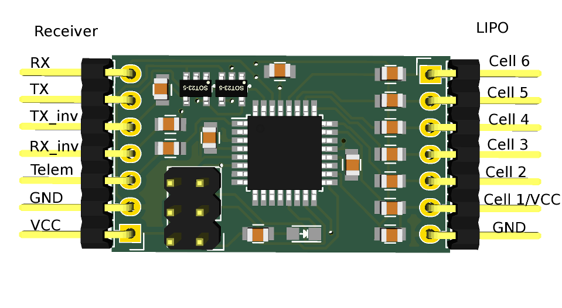
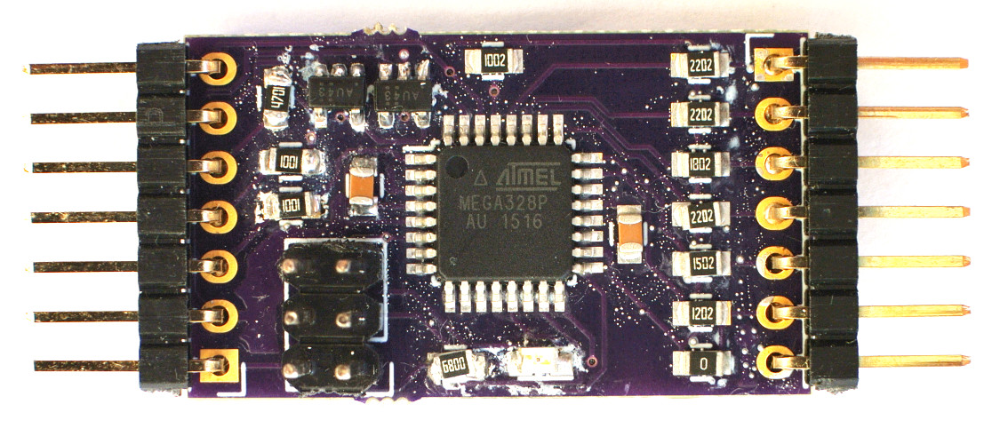
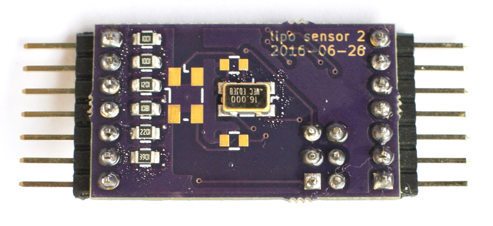

# LiPoSensor
This is a Li-Poly voltage sensor that connects to Frsky receivers or to flight controllers that
support one of the Frsky telemetry protocols.
This repository includes the Arduino source code and the KiCad PCB.

# Compiling
You need Arduino >= 1.6.

# Board
*WARNING: DO NOT POWER THE BOARD FROM BOTH LIPO AND RECEIVER AS IT MIGHT CATCH FIRE*

You need KiCad >= 4.0 to edit the PCB.

You can order the PCB from OSH Park:

<a href="https://oshpark.com/shared_projects/UHJ9S4BJ"></img></a>

